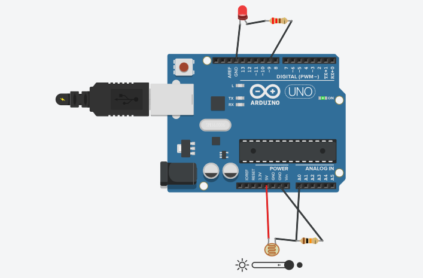
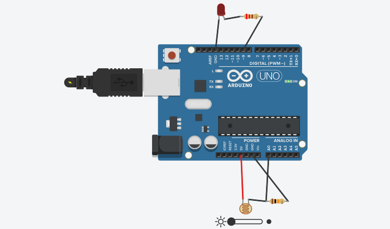

# Automatic Street Light Controller

An Arduino-based automatic street light controller that uses an LDR (photoresistor) to detect ambient light intensity and automatically control an LED.

## Project Objective

To design and simulate an automatic street light system that turns the LED ON when the environment becomes dark and turns it OFF when sufficient light is present.

## Components Used

- Arduino Uno R3
- LDR (Photoresistor)
- 10 kΩ Resistor
- LED
- 220 Ω Resistor
- Jumper wires

## Technologies

- Arduino
- C/C++ (Arduino programming)
- Tinkercad Circuits Simulation

## Working Principle

The LDR senses the surrounding light intensity and forms a voltage divider with the 10 kΩ resistor.

The Arduino reads the sensor value through analog pin A0 and compares it with a predefined threshold.

- Dark condition → LED ON
- Bright condition → LED OFF

The LED is connected to digital pin 9 through a 220 Ω resistor.

## Circuit

The project was designed and tested using Tinkercad Circuits.

## Simulation Results

### Bright Condition

When sufficient light is detected, the LED remains OFF.

### Dark Condition

When the light level decreases below the threshold, the LED turns ON.

## Project Files

- `automatic_street_light.ino` — Arduino source code
- `bright_condition.png` — Bright-condition simulation
- `dark_condition.png` — Dark-condition simulation

## Conclusion

The simulated system successfully demonstrates automatic street light control based on ambient light intensity using an Arduino and LDR sensor.
